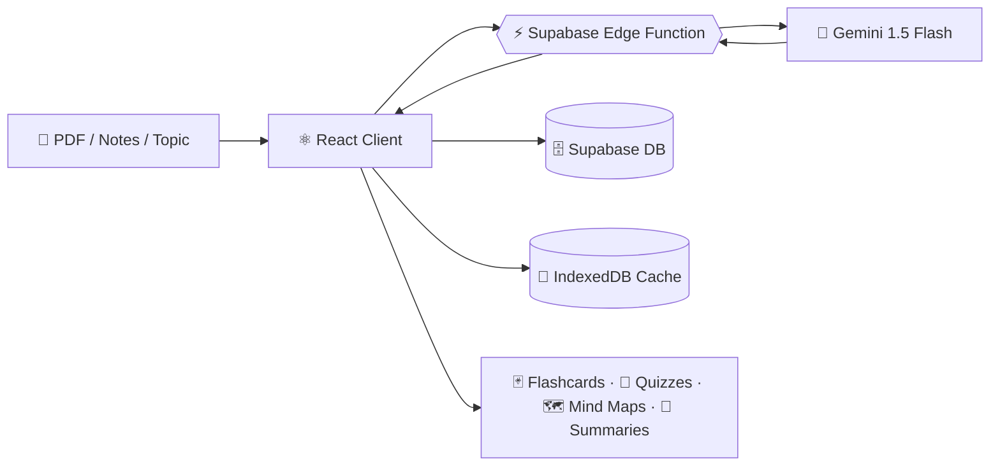

<!-- ═══════════════════════ ANIMATED HERO BANNER ═══════════════════════ -->
<div align="center">


<a href="https://github.com/AbhijeetKushwaha1213/StudyMate-Multimodal-AI-Hackathon-2026">
  
</a>

<br/>

[](https://reactjs.org/)
[](https://www.typescriptlang.org/)
[](https://vitejs.dev/)
[](https://tailwindcss.com/)
[](https://supabase.com/)
[](https://ai.google.dev/)


**[Interactive Pitch Deck](public/pitch.html) · [Demo Video Plan](docs/demo/DEMO_SCRIPT.md) · [Architecture](docs/architecture/ARCHITECTURE_OVERVIEW.md) · [Evaluation Report](docs/evaluation/EVALUATION_SUMMARY.md) · [Getting Started](docs/setup/DEMO_SETUP_GUIDE.md)**

</div>

---

## 🎬 Hackathon Presentation Package & Live Demo

<div align="center">

<!-- Video Walkthrough & Presentation Links -->
<h3>Ming — Multimodal AI-Powered Adaptive Learning Platform</h3>
<p><i>Mathematically grounded mastery, Bayesian Knowledge Tracing, and evidence-grounded source citations.</i></p>

<sub>
  📊 <a href="public/pitch.html" target="_blank"><b>Open Interactive Pitch Deck (HTML)</b></a> &nbsp;•&nbsp;
  📑 <a href="docs/pitch/PITCH_DECK.md"><b>Pitch Deck Source (MD)</b></a> &nbsp;•&nbsp;
  🎥 <a href="docs/demo/DEMO_SCRIPT.md"><b>Demo Recording Script & Timeline</b></a> &nbsp;•&nbsp;
  🏛️ <a href="docs/architecture/ARCHITECTURE_OVERVIEW.md"><b>Architecture Overview</b></a> &nbsp;•&nbsp;
  📈 <a href="docs/evaluation/EVALUATION_SUMMARY.md"><b>Evaluation Summary ($N=147$)</b></a>
</sub>

</div>

---

## 🚀 Overview

**Ming AI** bridges the gap between scattered study materials (lecture slides, textbook PDFs, notes, and problem sets) and structured learning. By leveraging multimodal AI capabilities powered by Google Gemini, Ming helps learners understand concepts deeply, test their knowledge adaptively, and retain what they learn, all in one unified workspace.

> 🏆 Built by **[Abhijeet Kushwaha](https://github.com/AbhijeetKushwaha1213)** for the **Multimodal AI Hackathon 2026**.

<table>
<tr>
<td align="center" width="25%"><h3>📄</h3><b>Upload</b><br/><sub>PDFs, notes, or just a topic</sub></td>
<td align="center" width="25%"><h3>🧠</h3><b>Generate</b><br/><sub>8 types of study material</sub></td>
<td align="center" width="25%"><h3>🎯</h3><b>Practice</b><br/><sub>Adaptive quizzes & flashcards</sub></td>
<td align="center" width="25%"><h3>📈</h3><b>Track</b><br/><sub>Progress across subjects</sub></td>
</tr>
</table>

---

## ✨ Key Features

### 🧠 1. Multimodal AI Content Generator
- **8 Interactive Material Types:** Flashcards, Quizzes, Mind Maps, Flowcharts, Smart Summaries, Revision Sheets, and Concept Breakdowns.
- **Flexible Input Modes:** Upload documents (PDF/Text), paste lecture notes, or enter a topic for instant curriculum-aligned generation.
- **Adaptive Difficulty:** Easy, Medium, Hard, or Adaptive AI mode with customized depth and key exam pointers.

<div align="center">
<!-- 👉 REPLACE: docs/screenshots/generator.png -->

</div>

### 📊 2. Dual-Mode Student Dashboards
- **🎓 College Mode:** Track courses, ongoing software projects, daily skill milestones, and portfolio progress.
- **📝 Exam Prep Mode:** Syllabus breakdown, mock test schedules, revision logs, and per-subject performance tracking.

<div align="center">
<!-- 👉 REPLACE: docs/screenshots/dashboard-college.png & dashboard-exam.png -->


</div>

### 💬 3. Grounded AI Tutor & Chat Assistant
- Instant doubt clarification, step-by-step problem solving, and concept deconstruction.
- Context-aware explanations with **markdown**, **code highlighting**, and **formula rendering**.

<div align="center">
<!-- 👉 REPLACE: docs/media/chat.gif -->

</div>

### ⏱️ 4. Focus Workspace & Interactive Dev Tools
- Integrated **Pomodoro** timer with ambient soundscapes.
- Embedded **Monaco** code editor and scratchpad for live problem solving.
- Practice launcher for **LeetCode** and **GitHub**.

### 📝 5. Notion-Style Resource Manager & Vault
- Block-based rich text note editor (TipTap).
- **Flashcard Vault** with spaced revision cycles and difficulty rating.
- **Offline support** and caching via IndexedDB for uninterrupted learning.

---

## 🖼️ Screenshots

> 💡 Replace each placeholder with a real capture. Recommended size: **1600×900**, PNG or WebP, stored in `docs/screenshots/`.

<details open>
<summary><b>🌗 Light & Dark Mode</b></summary>
<br/>
<div align="center">


</div>
</details>

<details>
<summary><b>🃏 Flashcards, Quizzes & Mind Maps</b></summary>
<br/>
<div align="center">


</div>
</details>

<details>
<summary><b>📅 Planner, Notes & Focus Timer</b></summary>
<br/>
<div align="center">


</div>
</details>

<details>
<summary><b>📱 Mobile / PWA</b></summary>
<br/>
<div align="center">


</div>
</details>

---

## 🧩 How It Works



---

## 🛠️ Tech Stack

| Layer | Technology |
| :--- | :--- |
| 🎨 **Frontend** | React 18, TypeScript, Vite, Tailwind CSS, Radix UI, Lucide Icons, Recharts, React Router |
| 🔄 **State & Data** | TanStack React Query, Dexie (IndexedDB), LocalStorage |
| ✍️ **Editor & UI** | Monaco Editor, TipTap Rich Text Editor, Tailwind CSS animations |
| ☁️ **Backend & DB** | Supabase (PostgreSQL, Auth, Storage, Edge Functions), Row Level Security (RLS), Node.js server, Prisma ORM, LibSQL |
| 🔍 **Vector DB & RAG** | ChromaDB (persistent HNSW cosine similarity), Collection: `studymate_multimodal_kb`, Hybrid Search (vector + lexical + topic boosting) |
| 🤖 **AI Engine** | Google Gemini API (`gemini-2.5-flash` with multi-model fallback), Supabase Edge Functions (Deno) |
| 🧠 **Learning Intelligence** | Bayesian Knowledge Tracing (BKT), mastery estimation, adaptive assessment, prerequisite-aware DAG generation |
| 🏛️ **AI Architecture** | Context-aware AI Study Agent, grounded generation with citation verification, structured JSON outputs, learning-state driven recommendations |
| 📚 **RAG Pipeline** | Python (PyPDF, python-pptx), multi-format extraction (PDF page-by-page, PPTX slide-by-slide, Video/Audio timestamped), ChromaDB embedding & cosine retrieval |

---

## 🏁 Getting Started

### Prerequisites
- **Node.js** v20.0 or higher (v22/v23 recommended)
- **npm** v10.0 or higher
- **Python** v3.11+ (for multimodal PDF/PPTX/video extraction & local RAG)
- A [Supabase](https://supabase.com/) project and a [Google Gemini API key](https://aistudio.google.com/)

### Installation & Environment Setup

```bash
# 1. Clone the repository
git clone https://github.com/AbhijeetKushwaha1213/StudyMate-Multimodal-AI-Hackathon-2026.git
cd StudyMate-Multimodal-AI-Hackathon-2026

# 2. Install Node dependencies (automatically runs prisma:generate via postinstall)
npm install

# 3. Set up environment variables from template
cp .env.example .env
```

Configure your `.env` following `.env.example`:

```env
# Client-side variables
VITE_SUPABASE_URL=https://your-project.supabase.co
VITE_SUPABASE_PUBLISHABLE_KEY=your_supabase_anon_key
VITE_GEMINI_API_KEY=your_gemini_api_key

# Backend runtime variables
GEMINI_API_KEY=your_gemini_api_key
DATABASE_URL=file:./prisma/dev.db
VECTOR_STORE=chroma
```

> ⚠️ **Never commit your `.env` file.** Keep credentials and API keys strictly out of version control.

### Local Development Commands

```bash
# Start both Node backend API (port 3001) and Vite frontend (port 3000 / 5173) concurrently
npm run dev

# Start frontend development server only (Vite)
npm run dev:vite

# Start Node backend API only (with file watch)
npm run dev:api

# Start backend in standalone production mode
npm run start:api
```

Open **http://localhost:3000** or **http://localhost:5173** in your browser 🎉

### Test, Typecheck & Production Build Commands

```bash
# Run complete Vitest test suite (60 test suites, 985 tests)
npm test

# Run TypeScript type check across the codebase
npx tsc --noEmit

# Run ESLint code quality checks
npm run lint

# Build production bundle (outputs to dist/)
npm run build

# Preview production build locally
npm run preview

# Run automated RAG evaluation benchmarks
npm run eval

# Run 50-client concurrency load benchmark
npm run loadtest
```

### Database & Migration Guidance

Ming uses a dual-engine database architecture:
- **Local Development**: SQLite via `@prisma/adapter-libsql` (`prisma/schema.prisma` -> `prisma/dev.db`) for lightweight zero-config testing.
- **Production / Staging**: PostgreSQL with `pgvector` (`prisma/schema.postgresql.prisma` and Supabase).

```bash
# Generate Prisma clients for both schemas
npm run prisma:generate

# Apply Supabase database migrations (requires Supabase CLI)
supabase db push

# Apply repair & study materials setup SQL manually if needed:
# supabase/fix-database.sql
```


---

## 📚 Documentation Directory

Ming contains comprehensive technical documentation organized into distinct domain areas:

| Category | Description | Key Documents |
| :--- | :--- | :--- |
| **🏛️ Architecture** | System topology, data flow, design system | [Architecture Overview](docs/architecture/ARCHITECTURE_OVERVIEW.md) • [System Architecture](docs/architecture/ARCHITECTURE.md) • [Design System](docs/architecture/DESIGN_SYSTEM.md) |
| **🚀 Setup & Guides** | Environment configuration, auth, local run | [Demo Setup Guide](docs/setup/DEMO_SETUP_GUIDE.md) • [Google Auth Setup](docs/setup/SETUP_GOOGLE_AUTH.md) • [Contributing Guide](docs/development/CONTRIBUTING.md) |
| **📊 Evaluation** | Benchmarks, compliance audits, metrics | [Evaluation Summary (N=147)](docs/evaluation/EVALUATION_SUMMARY.md) • [Compliance Audit](docs/evaluation/TRACK_D_FINAL_COMPLIANCE_AUDIT.md) • [Track D Audit](docs/evaluation/TRACK_D_AUDIT_REPORT.md) • [Educational Analysis](docs/evaluation/COLLEGE_AI_STUDY_COMPANION_ANALYSIS.md) |
| **🗺️ Roadmap & Phases** | Historical phase completion reports | [Phase 10: Final Release](docs/roadmap/phases/PHASE_10_FINAL_RELEASE.md) • [Phase 9: Product Readiness](docs/roadmap/phases/PHASE_9_PRODUCT_READINESS.md) • [Phase 8: Evaluation](docs/roadmap/phases/PHASE_8_EVALUATION.md) • [All Phases (2-10)](docs/roadmap/phases/) |
| **🎬 Demo & Pitch** | Live presentation and demo scripts | [Interactive Deck (HTML)](public/pitch.html) • [Pitch Deck (MD)](docs/pitch/PITCH_DECK.md) • [Demo Script](docs/demo/DEMO_SCRIPT.md) • [Sample Materials](docs/demo/sample_materials/) |
| **🛠️ Development** | Audits, conventions, repository health | [Repository Structure Audit](docs/development/REPOSITORY_STRUCTURE_AUDIT.md) • [Contributing Guide](docs/development/CONTRIBUTING.md) |

---

## 📁 Project Structure

<details open>
<summary><b>Click to toggle project tree</b></summary>

```text
ming/
├── package.json                   # Dependencies, build & test scripts
├── .env.example                   # Environment variable template (sanitized)
├── requirements.txt               # Python dependencies for multimodal processing
│
├── docs/                          # Comprehensive technical documentation
│   ├── architecture/              # Architecture diagrams, data flow & design system
│   ├── setup/                     # Setup, authentication, and quickstart guides
│   ├── evaluation/                # Benchmark results, compliance & audit reports
│   ├── roadmap/phases/            # Historical phase completion reports (Phases 2-10)
│   ├── demo/                      # Demo script, timeline & sample study materials
│   ├── pitch/                     # Pitch deck source markdown
│   └── development/               # Architecture audit and contributing conventions
│
├── src/                           # Frontend React 18 / TypeScript application
│   ├── api/                       # Typed client API callers & test mocks
│   ├── components/                # Modular UI & domain components
│   ├── hooks/                     # Custom React hooks
│   ├── integrations/              # Supabase client & generated database types
│   ├── pages/                     # Top-level application routes
│   ├── services/                  # Cache, telemetry, and storage services
│   ├── test/                      # Vitest unit, integration & security test suites
│   ├── types/                     # Shared TypeScript interface definitions
│   └── utils/                     # Formatting, math, and study plan utilities
│
├── server/                        # Backend Node.js/TypeScript & Python multimodal runtime
│   ├── index.ts                   # HTTP server entry point & route gateway
│   ├── ragHandler.ts              # Ingestion & retrieval orchestration
│   ├── learnerHandler.ts          # BKT evidence ingestion & mastery API
│   ├── studyAgentHandler.ts       # AI study loop & personalized intervention API
│   ├── evaluationHandler.ts       # Evaluation reporting endpoints
│   ├── videoHandler.ts            # Video transcript & lecture processing
│   ├── analyticsHandler.ts        # Telemetry ingestion & query handling
│   ├── rag_engine.py              # Canonical multimodal extraction & hybrid search
│   └── vector_store_pgvector.py   # PostgreSQL pgvector tenant-scoped vector store
│
├── scripts/                       # Development, migration, benchmarking & load harness
│   ├── dev.ts                     # Concurrently starts Node backend & Vite frontend
│   ├── run-load-benchmark.ts      # 50-client concurrency & load testing harness
│   ├── vector_load_worker.py      # In-memory vector embedding worker for load tests
│   ├── migrate-sqlite-to-postgres.ts # SQLite to PostgreSQL data migration
│   └── migrate_chroma_to_pgvector.py # ChromaDB to pgvector migration
│
├── benchmarks/                    # Evaluation datasets & benchmark runner
│   ├── data/                      # Multi-modal evaluation questions & learner traces
│   ├── results/                   # Historical and latest JSON/CSV benchmark runs
│   └── run-evaluation.ts          # Automated benchmark execution runner
│
├── prisma/                        # Database schemas & client generation
│   ├── schema.prisma              # Local development SQLite schema
│   ├── schema.postgresql.prisma   # Production PostgreSQL / pgvector schema
│   └── generated-pg-client/       # Generated PostgreSQL Prisma client (git-ignored)
│
├── supabase/                      # Cloud database & Edge Functions
│   ├── functions/                 # Supabase Edge Functions (ai-assistant)
│   ├── migrations/                # SQL migrations & RLS policies
│   └── fix-database.sql           # Database fix & initialization script
│
└── public/                        # Static web assets & presentation materials
    ├── pitch.html                 # Self-contained interactive pitch deck
    └── assets/                    # Logos, hero images, and branding assets
```

</details>

---

## 🗺️ Roadmap

- [x] Multimodal AI content generator (8 material types)
- [x] College & Exam dual dashboards
- [x] Grounded AI tutor chat with source citation attribution
- [x] Bayesian Knowledge Tracing (BKT) & SM-2 spaced repetition
- [x] Autonomous AI Study Agent with proactive interventions
- [x] Study session persistence, daily streaks & analytics
- [x] Offline caching & telemetry queue with auto-synchronization
- [x] Multi-tier production data plane (pgvector / ChromaDB)
- [ ] Live Classroom LTI 1.3 LMS sync (Canvas / Blackboard)
- [ ] Speech-to-text audio lecture transcription (Whisper API)
- [ ] Collaborative peer study rooms

---

## 🤝 Contributing

Contributions, issues, and feature requests are welcome!

1. 🍴 Fork the project
2. 🌿 Create your branch: `git checkout -b feature/amazing-feature`
3. 💾 Commit: `git commit -m "feat: add amazing feature"`
4. 🚀 Push: `git push origin feature/amazing-feature`
5. 🔁 Open a Pull Request

---

## 👨‍💻 Author

<div align="center">

<a href="https://github.com/AbhijeetKushwaha1213">
  
</a>

### **Abhijeet Kushwaha**

[](https://github.com/AbhijeetKushwaha1213)
[](mailto:abhijeetkushwaha1213@gmail.com)

</div>

---

## 📄 License

Distributed under the **MIT License**. See [`LICENSE`](LICENSE) for details.

<div align="center">

<br/>

⭐ **If Ming AI helped you, please give it a star!** ⭐


</div>
