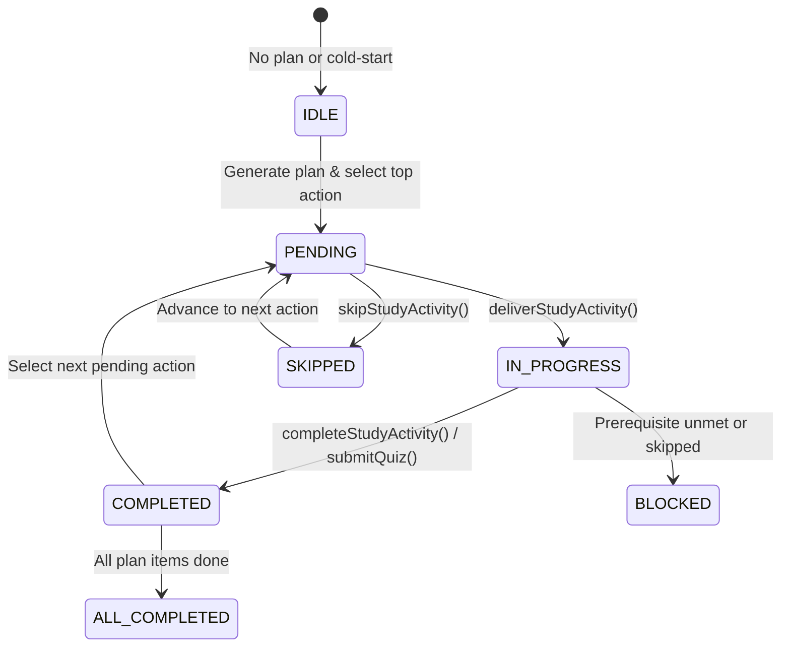

# Phase 6: AI Study Agent & Closed-Loop Adaptive Learning

## 1. Canonical Roadmap Status

| Phase | Description | Status |
|---|---|---|
| **Phase 1** | Foundation & Multimodal Ingestion | COMPLETE |
| **Phase 2** | Knowledge Ingestion & Vector Graph Store | COMPLETE |
| **Phase 3** | Grounding & Coordinate Cross-Verification | COMPLETE |
| **Phase 4** | Robust Multimodal Assessment & Deterministic Grading | COMPLETE |
| **Phase 5** | Learner Intelligence (BKT Model, Retention Decay, Adaptive Recommendations) | COMPLETE |
| **Phase 6** | **AI Study Agent & Closed-Loop Adaptive Learning** | **COMPLETE** |
| **Phase 7** | Production Scalability | NEXT |
| **Phase 8** | Evaluation & Quality Benchmarks | PENDING |
| **Phase 9** | Product Experience & Polish | PENDING |
| **Phase 10** | Final Hackathon Submission Polish | PENDING |

---

## 2. Executive Overview & Problem Addressed

Prior to Phase 6, Ming possessed state-of-the-art learner intelligence capabilities built in Phase 5:
1. **Canonical Learner Evidence Extraction & Bayesian Knowledge Tracing (BKT)** (Phase 5 Step 1).
2. **Ebbinghaus Forgetting Curve Retention Estimation & BKT Calibration** (Phase 5 Step 2).
3. **Multi-Factor Adaptive Recommendations across 6 Canonical Categories** (Phase 5 Step 3).

However, the learner-facing daily study planner had not yet been wired into a **closed-loop adaptive cycle**. Study plans operated statically or independently of the active mastery state, and status transitions allowed client-side manipulation without authoritative evidence recording.

**Phase 6 closes this loop.** It establishes an autonomous, evidence-driven **AI Study Agent** that turns the platform into a continuous cycle:
```
  ┌──────────────────────────────────────────────────────────┐
  │                                                          │
  ▼                                                          │
Observe Learner State (BKT, Recall, Misconceptions)          │
  │                                                          │
  ▼                                                          │
Select Next Study Action (Deterministic Adaptive Recs)       │
  │                                                          │
  ▼                                                          │
Deliver Learning Activity (Grounded Content Scoping)         │
  │                                                          │
  ▼                                                          │
Evaluate Learner Response (Authoritative Phase 4 Verifier)   │
  │                                                          │
  ▼                                                          │
Record Verified Evidence (Bayesian Posterior Update)         │
  │                                                          │
  └──────────────────────────────────────────────────────────┘
```

---

## 3. Core Architecture & Components

### 3.1 Adaptive Lifecycle State Machine

Every study action transitions deterministically through well-defined lifecycle states:



- **`IDLE`**: No active study plan exists; triggering next-action generates a plan from real user course materials or diagnostic checks.
- **`PENDING`**: Next action has been selected and prioritized, waiting for learner commencement.
- **`IN_PROGRESS`**: Activity content delivered and locked to learner; resumes automatically on reload.
- **`COMPLETED`**: Verified evidence ingested, topic mastery updated, item marked complete with `completedAt`.
- **`BLOCKED`**: Item paused due to unmet prerequisites or learner deferral.
- **`ALL_COMPLETED`**: Daily learning objectives achieved.

### 3.2 Canonical Category Integration

The study agent maps the 6 canonical Phase 5 categories directly to actionable study activities:

| Canonical Category | Agent Activity Type | UI Title & Outcome | Content Delivery Scope |
|---|---|---|---|
| `ADDRESS_MISCONCEPTION` | `RESOLVE_MISCONCEPTION` | **Resolve Misconception: [Concept]** — Grounded conceptual remediation | Targeted misconception questions + referenced citations |
| `REVIEW_CONCEPT` | `REVIEW_SOURCE` | **Review Concept: [Concept]** — Counteract Ebbinghaus retention decay | Source chunk / slide coordinates |
| `PRACTICE_CONCEPT` | `PRACTICE_WEAK_CONCEPTS` | **Practice [Concept]** — Developing mastery reinforcement | Multi-difficulty assessment questions |
| `LEARN_CONCEPT` | `DIAGNOSTIC_ASSESSMENT` / `PRACTICE_ASSESSMENT` | **Diagnostic Check / Learn: [Concept]** — Calibrate initial baseline | Cold-start diagnostic questions |
| `CONSOLIDATE_MASTERY` | `PRACTICE_ASSESSMENT` | **Consolidate Mastery: [Concept]** — Cement long-term retention | High-level synthesis challenges |
| `NO_ACTION` | `N/A` | Daily goals satisfied; explore catalog | None |

---

## 4. API Endpoints & Contracts

All endpoints enforce multi-tenant session isolation via `resolveContextUser`:

### `GET /api/agent/next-action`
Returns the learner's authoritative next study action and current lifecycle state.
- **Response**:
  ```json
  {
    "action": {
      "id": "item_1728512345_abcde",
      "planId": "plan_1728512345_xyz",
      "conceptId": "c_a1b2c3d4e5f6g7h8",
      "category": "ADDRESS_MISCONCEPTION",
      "activityType": "RESOLVE_MISCONCEPTION",
      "topic": "Operating Systems",
      "subtopic": "Deadlocks",
      "title": "Resolve Misconception: Deadlock Avoidance vs Prevention",
      "description": "Targeted adaptive activity based on verified learner intelligence.",
      "estimatedMinutes": 20,
      "reason": "Repeated conceptual confusion detected across multiple assessments.",
      "status": "pending",
      "sourceId": "res_123",
      "questionId": "q_456"
    },
    "lifecycleState": "PENDING",
    "planProgress": {
      "completedCount": 1,
      "totalCount": 4,
      "percentComplete": 25
    }
  }
  ```

### `GET /api/agent/activity/:actionId`
Delivers grounded learning content and transitions the action to `in_progress`.
- **Response**:
  ```json
  {
    "action": { ... },
    "lifecycleState": "IN_PROGRESS",
    "questions": [
      {
        "id": "q_456",
        "question": "Which Coffman condition is eliminated by imposing a linear ordering on resources?",
        "type": "MCQ",
        "options": ["Mutual exclusion", "Hold and wait", "No preemption", "Circular wait"]
      }
    ],
    "resource": {
      "id": "res_123",
      "title": "Operating Systems Deadlocks Lecture",
      "type": "PDF"
    }
  }
  ```

### `POST /api/agent/activity/:actionId/complete`
Authoritatively advances the study loop. If assessment answers are supplied, passes them through the Phase 4 deterministic verifier.
- **Body**: `{ "score": 100, "assessmentData": { ... } }`
- **Response**: `{ "success": true, "action": { ... }, "nextAction": { ... }, "lifecycleState": "PENDING" }`

### `POST /api/agent/activity/:actionId/skip`
Defers the current activity to the next pending item without altering or penalizing latent BKT mastery.
- **Response**: `{ "success": true, "skippedActionId": "...", "nextAction": { ... }, "lifecycleState": "PENDING" }`

---

## 5. Security & Zero-Trust Verification Guarantees

1. **No Client-Side Mastery Mutation**:
   - Marking a task completed or checking a box on the UI **never** writes synthetic scores or fake evidence events into the database.
   - Mastery probabilities update *strictly* through `recordLearnerEvidence` triggered by the authoritative Phase 4 grading engine.
2. **Tenant Isolation**:
   - Every study plan, plan item, event, and assessment question is strictly scoped to `userId`.
   - Accessing or modifying another user's action ID returns an authoritative `404 Not Found` or `403 Forbidden`.
3. **Non-Destructive Skipping**:
   - Skipping an action advances the study queue without registering false negative trials in the BKT model.

---

## 6. Verification Results

All tests execute in deterministic environments without external network dependencies.

### 6.1 Phase 6 Test Suite (`src/test/aiStudyLoop.test.ts`)
- **Total Tests**: 29
- **Passing**: 29 (100%)
- **Test Categories**:
  - `1. Next Action Selection & Cold-Start Behavior` (5 tests)
  - `2. Activity Delivery & Grounded Content Scoping` (5 tests)
  - `3. Activity Completion & Loop Advancement` (4 tests)
  - `4. Zero-Trust Assessment Grading Integration & Evidence Chain` (2 tests)
  - `5. Activity Skipping & Non-Destructive Progression` (1 test)
  - `6. Lifecycle Transitions & State Invariants` (2 tests)
  - `7. Multi-Tenant Security & Zero-Trust Isolation` (3 tests)
  - `8. HTTP Handler Integration` (5 tests)
  - `9. Regression Verification across Phases 4 & 5` (2 tests)

### 6.2 Full Project Test Suite
- **Total Test Files**: 57
- **Total Tests**: 933
- **Passing**: 933 (100%)
- **Regressions**: 0

### 6.3 Type Safety & Production Build
- **TypeScript (`tsc --noEmit`)**: 0 errors
- **Production Bundle (`npm run build`)**: Built in 10.12s
